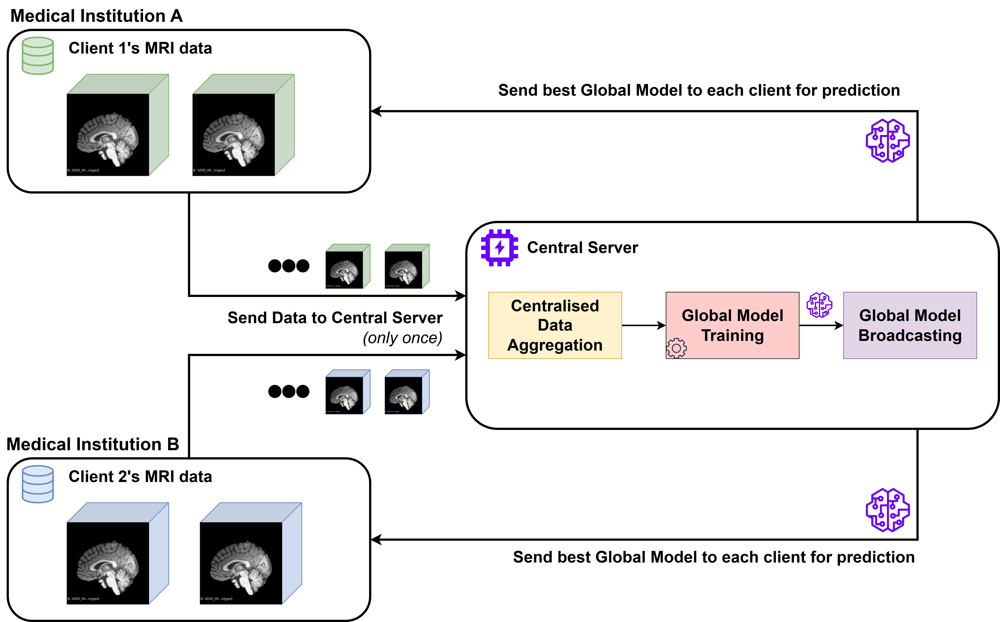
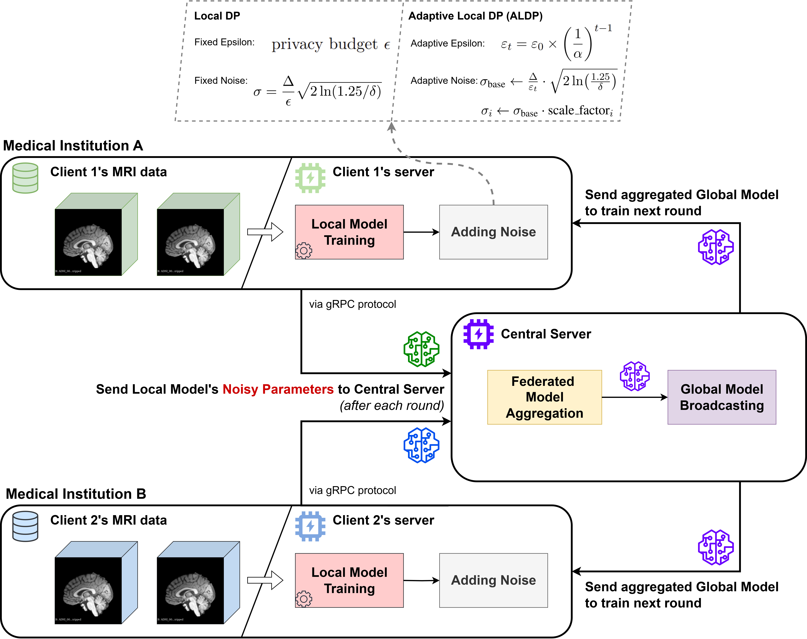
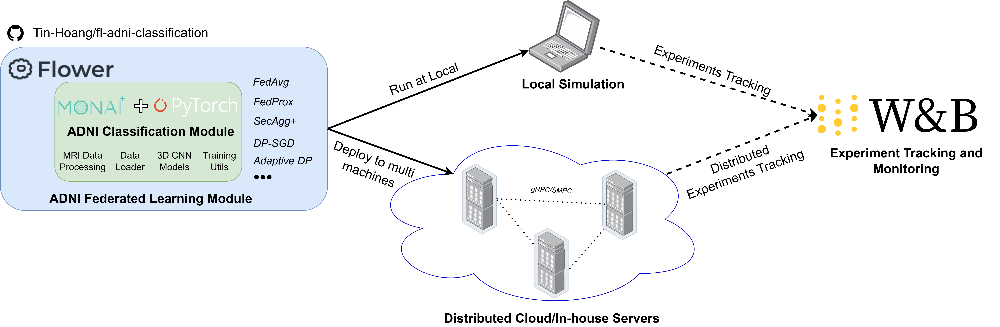

# Federated Learning for Privacy-Preserving Alzheimer's Disease Classification on 3D MRI Data

<div align="center">

[](https://github.com/Tin-Hoang/fl-adni-classification)
[](https://pytorch.org/)
[](https://flower.dev/)
[](https://github.com/astral-sh/uv)
[](https://github.com/astral-sh/ruff)
[](https://monai.io/)
[](https://github.com/Tin-Hoang/fl-adni-classification/actions/workflows/functional_test.yml)
[](https://github.com/Tin-Hoang/fl-adni-classification/stargazers)
[](https://github.com/Tin-Hoang/fl-adni-classification/network/members)

</div>

***Abstract:** Federated learning enables medical institutions to collaboratively train diagnostic AI models while maintaining strict patient data privacy. This research advances the field by focusing on Alzheimer’s disease classification using 3D MRI scans from the ADNI dataset. We introduce a novel site-aware data partitioning method that realistically mirrors multi-institutional data boundaries and heterogeneity, addressing limitations of previous approaches. The proposed Adaptive Local Differential Privacy (ALDP) mechanism dynamically adjusts its privacy parameters during training, resulting in significant improvements in accuracy and stability compared to traditional fixed-noise methods. Through comprehensive benchmarking and ablation studies, the work demonstrates that federated optimisation algorithms like FedProx can achieve performance equal to or better than centralized models, with ALDP reaching up to 80.4% accuracy, outperforming standard local DP approaches by 5–7 percentage points. These findings provide practical standards and guidelines for deploying privacy-compliant collaborative medical AI in real-world healthcare settings.*

This project supports both centralized and federated learning approaches for Alzheimer's Disease classification.

### Centralized Training

In centralized training, all MRI data from different institutions is aggregated in a single central server for model training. The data is processed and used to train a single global model without any privacy-preserving mechanisms.

<p align="center">
  
</p>

### Federated Learning

In federated learning, data remains distributed across participating institutions, ensuring strict privacy preservation. Each client trains locally on their own data and only shares encrypted model updates with the central server, never exposing raw patient data. This project implements **Adaptive Local Differential Privacy (ALDP)**, a novel contribution that dynamically adjusts privacy parameters during training to achieve superior accuracy while maintaining strong privacy guarantees.

#### Key Features:
- **Privacy-Preserving**: Patient data never leaves the institution
- **Adaptive Differential Privacy**: Dynamic noise adjustment for optimal utility-privacy trade-off
- **Secure Aggregation**: Encrypted model updates using SecAgg+ protocol
- **Multi-Strategy Support**: FedAvg, FedProx, and custom ALDP implementations

<p align="center">
  
  <br>
  <em>Overview of the Federated Learning system with Adaptive Local Differential Privacy - a key novelty of this research</em>
</p>


<details>
<summary>Repo Folder Structure</summary>

```
fl-adni-classification/
├── adni_flwr/           # Federated learning implementation (Flower)
│   ├── client_app.py    # FL client application
│   ├── server_app.py    # FL server application
│   ├── server_fn.py     # Server functions
│   ├── task.py          # FL task definitions
│   └── strategies/      # FL aggregation strategies
├── adni_classification/ # Core classification components
│   ├── models/          # Model implementations
│   ├── datasets/        # Dataset implementations
│   ├── utils/           # Utility functions
│   └── config/          # Configuration management
│       ├── config.py    # Main configuration
│       └── fl_config.py # FL-specific configuration
├── scripts/             # Training and utility scripts
│   ├── train.py         # Main training script
│   ├── preprocess_mri.py # MRI preprocessing pipeline
│   ├── split_data_for_fl.py # Data splitting for FL
│   ├── filter_csv_by_images.py # CSV filtering utilities
│   ├── calculate_adni_statistics.py # Statistics calculation
│   └── [other utility scripts]
├── configs/             # Configuration YAML files
├── data/                # Data directory
├── logs/                # Training logs
├── run_local_simulation.py    # Run local simulation (single machine)
├── run_multi_machines_tmux.py # Distributed multi-machine FL with tmux
├── pyproject.toml             # Project dependencies (uv)
└── README.md                  # Project documentation
```
</details>

## Setup

Using UV for dependency management:

```bash
# Install UV
curl -LsSf https://astral.sh/uv/install.sh | sh

# Create a virtual environment and install dependencies
uv venv --python 3.11
# Activate the virtual environment
source .venv/bin/activate

# Install required dependencies
uv pip install -e .
```

## Usage

### Repository Architecture

The repository is organized into distinct modules that work together to support both centralized and federated learning approaches for Alzheimer's disease classification:

<p align="center">
  
  <br>
  <em>Overview of the repository's modular architecture showing the core components and their interactions</em>
</p>

- **`adni_classification/`**: Core classification components including model architectures, dataset implementations, and configuration management
- **`adni_flwr/`**: Federated learning implementation built on Flower framework, containing client/server apps, FL strategies, and task definitions
- **`scripts/`**: Utility scripts for training, preprocessing, and data management
- **`configs/`**: YAML configuration files for different experiments and scenarios

### Basic Training (centralized training)
```bash
python scripts/train.py --config configs/default.yaml
```

### Federated Learning (using Flower)
#### Option 1: FL Local Simulation (single machine)
- Modify `pyproject.toml` to configure the FL simulation:
  - `client-config-files` is the path to the client config files, each client config file is a YAML file that contains the configuration for a single client.
  - `server-config-file` is the path to the server config file.
  - `options.num-supernodes` is the number of supernodes.
  - `options.backend.client-resources.num-cpus` is the number of CPUs per client.
  - `options.backend.client-resources.num-gpus` is the number of GPUs per client.

- Run the following command to start the FL local simulation (single machine):
```bash
flwr run .
```

Or, using the following command to start the FL server
```bash
# Single machine FL
python run_local_simulation.py configs/<experiment_name>/fl_server.yaml
```

#### Option 2: FL Multi-Machine Deployment

The project supports distributed multi-machine deployment via [Flower network communication](https://flower.ai/docs/framework/ref-flower-network-communication.html) with automated SSH tunnel establishment when needed.

##### Prerequisites

1. **SSH Access**: Ensure passwordless SSH access to all client machines or set the `FL_PASSWORD` environment variable
2. **Synchronized Project**: The project directory must be synchronized across all machines
3. **Virtual Environment**: Python virtual environment must be set up on all machines with identical paths
4. **Network Configuration**: Ensure machines can communicate via SSH (port 22) and Flower ports (if no firewall restrictions)

##### Configuration Steps

**Step 1: Configure Multi-Machine FL in `fl_server.yaml`**

Add the `multi_machine` section to your FL configuration:
<details>
<summary>Configuration for Multi-Machine FL</summary>

```yaml
fl:
  # Standard FL parameters
  num_rounds: 100
  fraction_fit: 1.0
  min_fit_clients: 4
  min_evaluate_clients: 4
  min_available_clients: 4
  local_epochs: 1
  strategy: "fedavg"
  evaluate_frequency: 5

  # Multi-machine configuration
  multi_machine:
    # Server machine configuration
    server:
      host: "<your_server_hostname>"      # Server hostname/IP
      username: "<your_username>"                    # SSH username
      password: null                         # Use FL_PASSWORD env var
      port: 9092                            # Flower server port
      config_file: "configs/experiment/fl_server.yaml"  # Server config path
      sequential_experiment: true           # Enable sequential experiments
      train_sequential_labels:             # Training data for sequential runs
        - "data/ADNI/LABELS/seed01/client_all_train.csv"
        - "data/ADNI/LABELS/seed10/client_all_train.csv"
        - "data/ADNI/LABELS/seed42/client_all_train.csv"
      val_sequential_labels:               # Validation data for sequential runs
        - "data/ADNI/LABELS/seed01/client_all_val.csv"
        - "data/ADNI/LABELS/seed10/client_all_val.csv"
        - "data/ADNI/LABELS/seed42/client_all_val.csv"

    # Client machines configuration
    clients:
      - host: "<client1_hostname>"    # Client 1 hostname/IP
        username: "<your_username>"                 # SSH username
        password: null                      # Use FL_PASSWORD env var
        partition_id: 0                     # Unique client ID
        project_dir: null                   # Use global project_dir
        config_file: "configs/experiment/client1.yaml"  # Client config path
        sequential_experiment: true         # Enable sequential experiments
        train_sequential_labels:           # Training data for this client
          - "data/ADNI/LABELS/seed01/client_1_train.csv"
          - "data/ADNI/LABELS/seed10/client_1_train.csv"
          - "data/ADNI/LABELS/seed42/client_1_train.csv"
        val_sequential_labels:             # Validation data for this client
          - "data/ADNI/LABELS/seed01/client_1_val.csv"
          - "data/ADNI/LABELS/seed10/client_1_val.csv"
          - "data/ADNI/LABELS/seed42/client_1_val.csv"

      - host: "<client2_hostname>"    # Client 2 configuration
        username: "<your_username>"
        password: null
        partition_id: 1
        project_dir: null
        config_file: "configs/experiment/client2.yaml"
        sequential_experiment: true
        train_sequential_labels:
          - "data/ADNI/LABELS/seed01/client_2_train.csv"
          - "data/ADNI/LABELS/seed10/client_2_train.csv"
          - "data/ADNI/LABELS/seed42/client_2_train.csv"
        val_sequential_labels:
          - "data/ADNI/LABELS/seed01/client_2_val.csv"
          - "data/ADNI/LABELS/seed10/client_2_val.csv"
          - "data/ADNI/LABELS/seed42/client_2_val.csv"

    # Project configuration (shared across all machines)
    project_dir: "<your_project_dir>/fl-adni-classification"
    venv_path: "<your_venv_path>/bin/python"
    venv_activate: "<your_venv_path>/bin/activate"

    # SSH configuration
    ssh:
      timeout: 30
      banner_timeout: 30
      auth_timeout: 30
```

</details>


**Step 2: Set Environment Variables**

```bash
# Set password for SSH authentication (if not using passwordless SSH)
export FL_PASSWORD="your_password_here"
```

**Step 3: Prepare Client Configuration Files**

Create individual client configuration files (e.g., `client1.yaml`, `client2.yaml`) with client-specific settings:

```yaml
# client1.yaml
data:
  train_csv_path: "data/ADNI/LABELS/seed01/client_1_train.csv"
  val_csv_path: "data/ADNI/LABELS/seed01/client_1_val.csv"
  img_dir: "data/ADNI/images"

model:
  name: "rosanna_cnn"
  num_classes: 2

training:
  batch_size: 4
  learning_rate: 0.001
  num_workers: 4

fl:
  client_id: 0
  local_epochs: 1
```

**Step 4: Deploy Multi-Machine FL**

```bash
# Multi-machine FL with tmux (recommended)
python run_multi_machines_tmux.py --config configs/experiment/fl_server.yaml

# Alternative: Multi-machine FL without tmux
python run_multi_machines.py --config configs/experiment/fl_server.yaml
```

##### Advanced Features

**Sequential Experiments**: The framework supports running multiple experiments with different random seeds automatically. Set `sequential_experiment: true` and provide lists of training/validation CSV files for different seeds.

**Automatic SSH Tunneling**: If machines cannot communicate via default Flower ports due to firewall restrictions, the system automatically establishes SSH tunnels.

**Dynamic Client Management**: The system handles client failures and reconnections automatically during training.

**Resource Monitoring**: Built-in GPU and memory monitoring across all client machines.

##### Troubleshooting

1. **SSH Connection Issues**: Ensure passwordless SSH or correct `FL_PASSWORD` environment variable
2. **Port Conflicts**: Modify `port` in server configuration if 9092 is occupied
3. **Synchronization Issues**: Ensure all machines have identical project directories and dependencies
4. **GPU Allocation**: Use `CUDA_VISIBLE_DEVICES` to control GPU usage per client

*Note: SSH tunnels will be established automatically between server and client nodes if direct communication via Flower ports is not possible.*

## Configuration

The project uses a sophisticated YAML-based configuration system with structured dataclasses located in `adni_classification/config/`. Configuration files are stored in the `configs/` directory.

### Configuration Structure

The configuration system is organized into five main sections:

#### 1. Data Configuration (`data:`)
- **Dataset paths**: `train_csv_path`, `val_csv_path`, `img_dir`
- **Dataset types**: `normal`, `cache`, `smartcache`, `persistent`
  - `normal`: Normal dataset (default)
  - `cache`: Cache dataset reference: https://docs.monai.io/en/stable/data.html#monai.data.CacheDataset
  - `smartcache`: Smart cache dataset reference: https://docs.monai.io/en/stable/data.html#monai.data.SmartCacheDataset
  - `persistent`: Persistent dataset reference: https://docs.monai.io/en/stable/data.html#monai.data.PersistentDataset
- **Image preprocessing**: `resize_size`, `resize_mode`, `spacing_size`
- **Classification modes**: `CN_MCI_AD` (3-class) or `CN_AD` (2-class). For `CN_AD` mode, users can optionally convert MCI samples to AD samples by DX_bl column to include only specific MCI subtypes: SMC (Significant Memory Concern), EMCI (Early MCI), or LMCI (Late MCI) with `mci_subtype_filter` parameter.
- **Caching options**: `cache_rate`, `cache_num_workers`, `cache_dir`

#### 2. Model Configuration (`model:`)
- **Model selection**: `resnet3d`, `densenet3d`, `simple_cnn`, `securefed_cnn`, `rosanna_cnn`
- **Architecture params**: `model_depth`, `growth_rate`, `block_config`
- **Pretrained models**: `pretrained_checkpoint`, `freeze_encoder`

#### 3. Training Configuration (`training:`)
- **Optimization**: `batch_size`, `learning_rate`, `weight_decay`, `num_epochs`
- **Advanced features**: `mixed_precision`, `gradient_accumulation_steps`
- **Loss functions**: `cross_entropy`, `focal` (with `focal_alpha`, `focal_gamma`)
- **Class balancing**: `use_class_weights`, `class_weight_type`, `manual_class_weights`
- **Checkpointing**: `save_best`, `save_latest`, `save_regular`, `save_frequency`

#### 4. Federated Learning Configuration (`fl:`)
- **FL strategies**: `fedavg`, `fedprox`, `secagg`, `secaggplus`
- **Round configuration**: `num_rounds`, `local_epochs`, `evaluate_frequency`
- **Client selection**: `fraction_fit`, `min_fit_clients`, `min_available_clients`
- **Strategy-specific**: `fedprox_mu`, `dp_noise_multiplier`, `dp_dropout_rate`, `secagg_num_shares`, `secagg_reconstruction_threshold`, `secagg_max_weight`, `secagg_timeout`, `secagg_clipping_range`, `secagg_quantization_range`

#### 5. Weights & Biases Configuration (`wandb:`)
- **Experiment tracking**: `use_wandb`, `project`, `entity`
- **Organization**: `tags`, `notes`, `run_name`


### Advanced Features

#### Dataset Caching
```yaml
data:
  dataset_type: "smartcache"
  cache_rate: 0.5
  cache_num_workers: 8
  transform_device: "cuda"
```

#### Focal Loss and Class Weighting for Class Imbalance
```yaml
training:
  loss_type: "focal"
  focal_alpha: 0.25
  focal_gamma: 2.0
  use_class_weights: true
  class_weight_type: "inverse"
```

#### Mixed Precision Training
```yaml
training:
  mixed_precision: true
  gradient_accumulation_steps: 2
```

## Data Format

The input data should be:
- 3D MRI images in .nii or .nii.gz format
- A CSV label file containing metadata with the following columns:
  - `image_id`: The ID of the image in the ADNI database (without 'I' prefix)
  - `subject_id`: The ID of the subject in the ADNI database
  - `DX`: Diagnosis group (AD, MCI, CN)
  - `DX_bl`: (optional) for filtering MCI samples to only include specific MCI subtypes: SMC (Significant Memory Concern), EMCI (Early MCI), or LMCI (Late MCI)

Images should be organized in the following structure
(ADNI downloaded data normally should follow this structure already):
```
<root_img_dir>/
└── <subject_id>/
    └── <intermediate_metadata_info (may more than one sublevel)>/
        └── ADNI_<subject_id>_<metadata_info>_I<image_id>.nii.gz
```

## ADNI MRI Preprocessing

The project includes a comprehensive MRI preprocessing pipeline that automates:
1. Resampling to 1mm isotropic spacing
2. Registration to a standard template (ICBM152)
3. Skull stripping using FSL BET

The preprocessing script includes advanced features such as resume functionality, directory filtering, progress tracking, and robust error handling.

📖 **For complete preprocessing documentation, see [docs/MRI_PREPROCESSING.md](docs/MRI_PREPROCESSING.md)**

### Quick Start

```bash
python scripts/preprocess_mri.py --input input_folder
```

**Requirements:** ANTs, FSL, Python 3.10+
